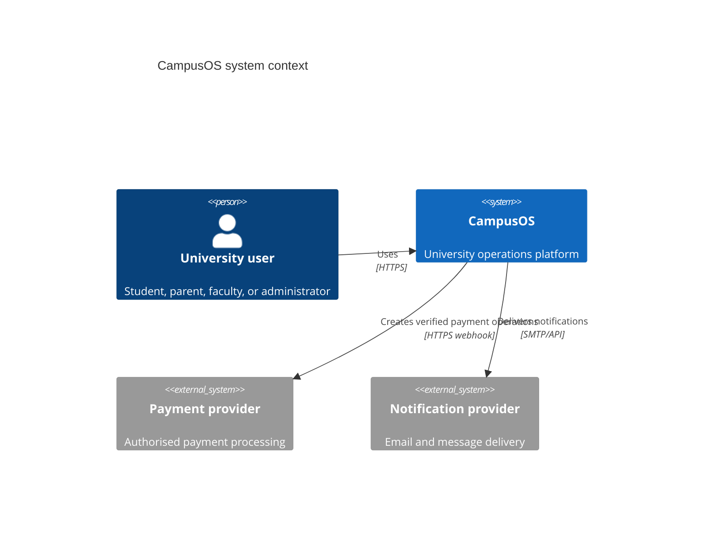
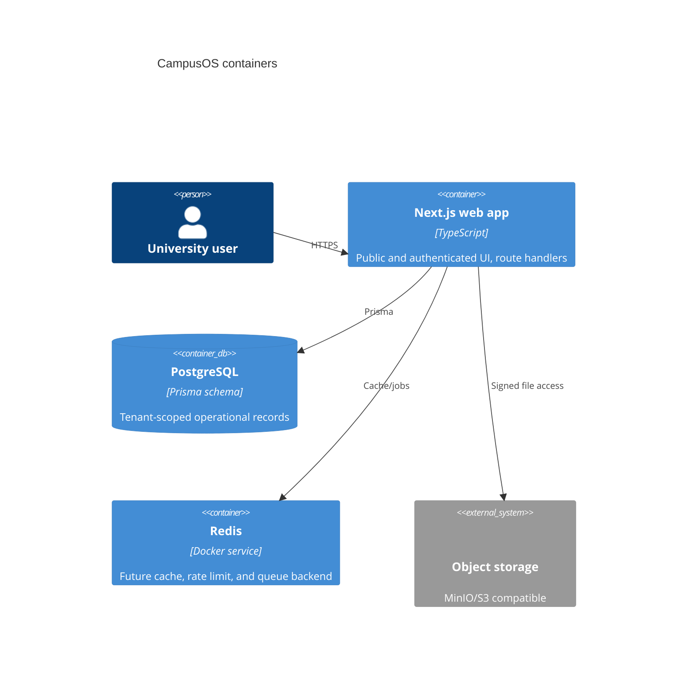
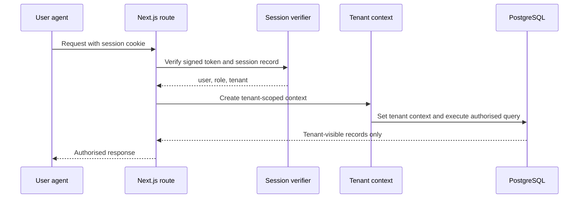
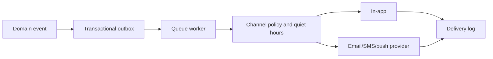

# CampusOS Phase 0 — Baseline Architecture and Product Audit

Status: audit complete. This document describes the existing repository and the next safe implementation boundary; it does not claim that incomplete controls are production-ready.

## Assumption

CampusOS is an existing product. Phase 0 is therefore an audit and hardening baseline, not a rewrite of its routes, UI, APIs, or database model.

## Capability comparison

Campx publicly presents five systems spanning academics, finance, operations, enrollment, and people, plus a permission-aware AI assistant. [Campx platform](https://campx.in/platform) and [Campx product overview](https://campx.in/) were reviewed on 2026-08-04.

| Module | Campx public capability | CampusOS target advantage | Priority |
| --- | --- | --- | --- |
| Notice board and updates | Targeted campus communications | Per-recipient delivery and acknowledgement evidence | P0 |
| Profile and identity | Student and staff records | Tenant-scoped audit history and verified device sessions | P0 |
| LMS and assignments | Learning and continuous evaluation | Permission-filtered AI assistance with source citations | P0 |
| Timetable | Academic scheduling | Constraint solver with conflict explanation and publish history | P0 |
| Attendance | Attendance workflows | QR, geofence, device binding, shortage projection | P0 |
| Course registration | Course and credit workflows | Atomic capacity reservation, waitlist, clash validation | P0 |
| Examination and results | Examination and OBE workflows | Approval chain, publication blockers, QR-verifiable records | P0 |
| Fees and payments | Fees, scholarships, payroll | Decimal-safe ledger and reconciled payment mutations | P0 |
| Hostel, transport, library | Operational services | SLA-backed requests, allocations, and access auditing | P1 |
| Helpdesk and student services | Service operations | Tenant-scoped request lifecycle and certificate verification | P1 |
| Admissions | CRM, applicant tracking, counselling | Conversion trace from lead through enrollment | P1 |
| Placements and alumni | Placement and alumni workspaces | Rules-based eligibility and verified outcome reporting | P1 |
| Parent portal | Parent-facing academic and finance visibility | Explicit linked-child authorization boundaries | P0 |
| Faculty workload and HR | Attendance, leave, appraisal, research | Separate payroll permission domain and auditable decisions | P1 |
| Accreditation | OBE and compliance reporting | Evidence-linked NAAC/NBA exports, not unsupported certification claims | P1 |
| AI assistant | Medha AI across systems | Tenant- and permission-filtered retrieval, prompt-injection tests, citations | P0 |

## Personas and landing workspaces

| Role | Five primary jobs | Landing workspace |
| --- | --- | --- |
| Super Admin | tenant health; onboarding; incidents; audit; support | Platform operations |
| Institution Admin | enrolment; departments; compliance; operations; financial overview | Institution overview |
| HOD | department courses; workload; approvals; attendance; risk | Department overview |
| Faculty | teaching schedule; attendance; assignments; marks; student questions | Teaching workspace |
| Student | timetable; learning; attendance; registration; payments | Student workspace |
| Parent | linked child progress; fees; notices; requests; approvals | Parent workspace |
| Warden | rooms; allocations; outpasses; complaints; safety | Hostel workspace |
| Accountant | invoices; collections; reconciliation; refunds; reports | Finance workspace |

## Current architecture









## Data model and tenancy baseline

The Prisma model is maintained at `packages/db/prisma/schema.prisma`; its entities cover the core academic, finance, campus-life, communications, research, operations, HR, wellbeing, and SaaS domains. The initial RLS migration is at `packages/db/prisma/migrations/0_init_rls/migration.sql`.

Current verified facts:

- Most application entities declare `tenant_id` in Prisma.
- The initial migration enables and defines policies for only a limited subset of tenant tables.
- The application also applies a Prisma tenant filter extension.
- Application filtering is a defence-in-depth layer, not a replacement for PostgreSQL RLS.

Required Phase 1 remediation: add a migration that enables and forces RLS and creates both `USING` and `WITH CHECK` policies for every tenant-scoped table; execute each request in a transaction that sets `app.current_tenant_id` locally. The policy must be tested through the same database role used by the application.

## Foundation inventory

```text
apps/web/                 Next.js web application and Playwright tests
packages/db/prisma/       Prisma schema and migrations
packages/types/           Shared domain types
packages/config/          Environment validation package
docker-compose.yml        PostgreSQL, Redis, MinIO, and MailHog services
```

## Critical gaps before Phase 1

1. The web TypeScript configuration is not strict and contains existing `any` usages.
2. RLS coverage is incomplete and the application currently relies in part on ORM filtering.
3. The full typecheck fails due to stale test imports, a missing config module, and an untracked seed script collision.
4. The production build reaches compilation but does not complete its lint/type stage in the current workspace.
5. Several README claims about certification, readiness, and test status are not verified by this audit and must not be used as production assurances.

## Phase 1 implementation boundary

Phase 1 should address only: database-enforced tenant isolation; verified session role/tenant derivation; RBAC/ABAC enforcement at route and service boundaries; write audit logs; secure super-admin impersonation; and test infrastructure cleanup. It must not introduce demo metrics or client-side privilege simulation.

## Verification checklist

- Start dependencies: `docker compose up -d`.
- Set a test-only `DATABASE_URL` and run Prisma migrations.
- Run `npx vitest run` and resolve all failures before counting the suite as passing.
- Run `npx tsc --noEmit -p apps/web/tsconfig.json` with zero diagnostics.
- Run `npm run build` from `apps/web` through completion.
- Test cross-tenant reads, writes, direct database access, signed-file access, and every privileged API route.

## Known limitations

No RLS policy expansion, schema rebuild, or provider integration was performed in this audit because each is a cross-cutting security change that requires a test database and migration review. Those are the first Phase 1 deliverables.
